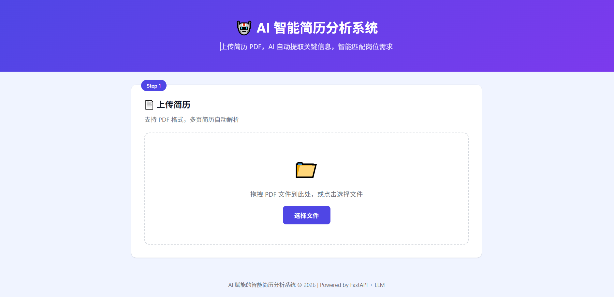

# AI 赋能的智能简历分析系统

基于 AI 的智能简历解析与岗位匹配系统。上传 PDF 简历，自动提取关键信息，并与招聘岗位需求进行智能匹配评分。

## 线上演示

🔗 **前端页面**：[https://fubenshuo.github.io/ai-resume-analyzer](https://fubenshuo.github.io/ai-resume-analyzer)  
🔗 **后端 API**：[https://ai-resume-analyzer-mujt.onrender.com](https://ai-resume-analyzer-mujt.onrender.com/docs)

## 界面预览

### 主界面 — 上传简历



### 分析结果 — 信息提取 + AI 匹配 + 缓存标识

.png)

## 功能特性

- **📄 简历解析** — 支持多页 PDF 简历上传，PyMuPDF + pdfplumber 双引擎自动提取文本
- **🔍 信息提取** — 基于 AI 识别姓名、电话、邮箱、学历、技能、项目经历、求职意向等
- **🎯 智能匹配** — 将简历与岗位描述进行四维度匹配评分（技能、经验、学历、职位）
- **🤖 AI 增强** — LLM 优先 + 规则降级双模式，前端实时显示当前使用 AI 还是规则
- **⚡ 缓存加速** — 内置 Redis + 内存双模式缓存，命中时前端显示缓存标识，秒出结果
- **🖥 可视化界面** — 三步式交互页面，上传 → 输入 JD → 查看匹配结果

## 技术架构

```
┌──────────────┐     ┌──────────────────┐     ┌─────────────┐
│   Frontend   │────▶│  FastAPI Backend  │────▶│  AI Model   │
│  GitHub Pages│     │     (Render)      │     │  (LLM API)  │
└──────────────┘     └────────┬─────────┘     └─────────────┘
                              │
                     ┌────────▼─────────┐
                     │  Cache (Memory    │
                     │   or Redis)      │
                     └──────────────────┘
```

### 技术选型

| 层级       | 技术                          | 说明                           |
| -------- | --------------------------- | ---------------------------- |
| **后端**   | Python + FastAPI            | 高性能异步 RESTful API           |
| **PDF 解析** | PyMuPDF + pdfplumber 双引擎 | 中文兼容性好，支持多页，图片 PDF 兜底    |
| **AI 模型** | 兼容 OpenAI 接口的 LLM（可配置）     | 通义千问/DeepSeek/GPT 等，支持推理模型  |
| **缓存**   | 内存缓存 + 可选 Redis            | 单实例用内存缓存, 分布式用 Redis         |
| **前端**   | 原生 HTML/CSS/JS             | 零依赖，GitHub Pages 自动部署       |
| **部署**   | Render / 阿里云函数计算 FC       | 支持 Serverless 部署             |

## 项目结构

```
├── backend/                   # 后端服务
│   ├── main.py                # FastAPI 应用入口 + API 路由
│   ├── config.py              # 环境配置（AI Key、缓存、上传限制）
│   ├── models.py              # Pydantic 数据模型
│   ├── pdf_parser.py          # PDF 解析模块 (PyMuPDF + pdfplumber)
│   ├── text_processor.py      # 文本清洗与智能分段
│   ├── info_extractor.py      # AI 信息提取（含正则 fallback）
│   ├── matcher.py             # 简历-JD 匹配评分（4 维度：技能/经验/学历/职位）
│   ├── cache.py               # 缓存管理（内存/Redis 双模式）
│   ├── test_diagnose.py       # 诊断工具（API 连通性 + PDF 解析 + AI 提取）
│   └── requirements.txt       # Python 依赖
├── frontend/                  # 前端页面
│   ├── index.html             # 主页面（三步交互）
│   ├── style.css              # 响应式样式
│   └── app.js                 # 交互逻辑
├── page/                      # 截图
├── .github/workflows/         # GitHub Actions（自动部署 Pages）
├── .env.example               # 环境变量示例
├── CLAUDE.md                  # Claude Code 指引
└── README.md                  # 本文件
```

## 快速开始

### 1. 环境准备

```bash
# Python 3.10+
python --version

# 克隆项目
git clone https://github.com/fubenshuo/ai-resume-analyzer.git
cd ai-resume-analyzer
```

### 2. 安装依赖

```bash
cd backend
pip install -r requirements.txt
```

### 3. 配置环境变量

```bash
cp .env.example .env
# 编辑 .env 文件，填入你的 AI API Key
```

关键配置项：

| 环境变量 | 说明 | 默认值 |
|---------|------|--------|
| `AI_API_BASE_URL` | AI API 地址 | `https://api.openai.com/v1` |
| `AI_API_KEY` | AI API 密钥 | `sk-your-api-key` |
| `AI_MODEL` | 模型名称 | `gpt-4o-mini` |
| `CACHE_TYPE` | 缓存类型 (`memory`/`redis`) | `memory` |
| `REDIS_URL` | Redis 地址 | `redis://localhost:6379/0` |
| `CACHE_TTL` | 缓存过期时间（秒） | `3600` |
| `AI_REQUEST_TIMEOUT` | AI 请求超时（秒） | `60` |
| `TEXT_MAX_CHARS` | 分析文本最大长度 | `8000` |

### 4. 启动后端

```bash
cd backend
python main.py
# 或
uvicorn main:app --host 0.0.0.0 --port 8000 --reload
```

访问 http://localhost:8000/docs 查看 Swagger API 文档。

### 5. 启动前端

```bash
cd frontend
python -m http.server 3000
# 访问 http://localhost:3000
```

## API 接口

### POST /api/upload
上传 PDF 简历文件。

- **请求**：`multipart/form-data`，字段 `file`（PDF 文件）
- **响应**：`{ resume_id, filename, text_preview }`

### POST /api/analyze/{resume_id}
对已上传的简历进行 AI 信息提取和岗位匹配。

- **请求**：`{ job_description: string }`
- **响应**：
```json
{
  "resume_id": "...",
  "status": "completed",
  "extraction_method": "ai",
  "match_method": "ai",
  "cached": false,
  "resume_info": {
    "basic_info": { "name": "...", "phone": "...", "email": "...", "address": "..." },
    "job_intent": { "position": "...", "salary": "..." },
    "background_info": { "work_years": "...", "education": {...}, "skills": [...], "project_experiences": [...] }
  },
  "match_result": {
    "matched_keywords": [...],
    "missing_keywords": [...],
    "match_detail": { "skill_match_rate": 0.85, "experience_relevance": 0.7, "education_match": 0.9, "overall_score": 82 },
    "ai_analysis": "..."
  }
}
```

### GET /api/health
健康检查。

## 部署指南

### 当前部署状态

| 组件 | 平台 | 地址 |
|------|------|------|
| 前端 | GitHub Pages | https://fubenshuo.github.io/ai-resume-analyzer |
| 后端 | Render | https://ai-resume-analyzer-mujt.onrender.com |

### 部署到阿里云函数计算 FC

**1. 开通服务**
- 登录 [阿里云控制台](https://fcnext.console.aliyun.com/)
- 开通"函数计算 FC"服务
- 地域建议选"华东1（杭州）"

**2. 创建函数**
- 服务名称：`resume-analyzer`
- 创建函数 → 使用 **Custom Runtime**
- 运行环境：Python 3.10
- 内存：512 MB
- 超时时间：120 秒

**3. 打包上传**

```bash
cd backend

# 安装依赖到本地目录
pip install -r requirements.txt -t ./package

# 复制项目文件到 package
cp *.py package/
cp bootstrap package/
chmod +x package/bootstrap

# 打包
cd package && zip -r ../deploy.zip . && cd ..
```

**4. 上传并配置**
- 函数代码 → 上传 `deploy.zip`
- 启动命令留空（由 bootstrap 自动执行）
- 环境变量添加：
  ```
  AI_API_BASE_URL=https://api.deepseek.com/v1
  AI_API_KEY=你的API Key
  AI_MODEL=deepseek-chat
  CACHE_TYPE=memory
  ```
- 创建 HTTP 触发器 → 认证方式选"无需认证"
- 获取公网访问地址

**5. 更新前端 API 地址**
- 修改 `frontend/app.js` 中的 `API_BASE`
- 提交并 push，GitHub Pages 自动更新

## 设计说明

### AI 降级策略（双引擎）

系统设计了完善的降级机制，前端实时显示当前工作模式：

| 组件 | AI 成功 | AI 失败 |
|------|---------|---------|
| 信息提取 | 🤖 AI 模型 | 📋 正则规则提取 |
| 匹配评分 | 🎯 AI 模型 | 📊 关键词规则匹配 |

- **信息提取**：LLM 优先，提取姓名、电话、邮箱、地址、求职意向、学历、技能、项目经历等；失败时自动切换正则规则提取
- **匹配评分**：LLM 优先，综合评估技能/经验/学历/职位匹配度；失败时自动切换关键词 + Jaccard 相似度规则匹配

### 缓存策略

- **内存缓存**（默认）：基于 dict + TTL，适合单实例开发调试
- **Redis 缓存**（可选）：适合 Serverless 多实例环境，跨实例共享分析结果
- 缓存 Key = `resume:analysis:<SHA256(简历文本 + JD文本)>`
- 缓存命中时前端显示 ⚡ 标识，后端日志打印命中记录

### 评分维度（四维度）

| 维度 | 权重 | 计算方式 |
|------|:--:|------|
| 技能匹配率 | 40% | 简历技能 ∩ JD 关键词 / JD 关键词（词边界匹配，避免"Java"误匹配"JavaScript"） |
| 经验相关性 | 20% | 简历工作年限 vs JD 要求年限 |
| 学历匹配度 | 20% | 简历最高学历 vs JD 最低学历要求 |
| 职位匹配度 | 20% | Jaccard 相似度 + 核心职位词精确匹配加分 |

### PDF 解析双引擎

- **PyMuPDF**（主引擎）：对中文 PDF 兼容性最好
- **pdfplumber**（备选）：遇到特殊排版 PDF 时兜底
- 文本分段预处理：自动识别"基本信息/教育背景/工作经历/项目经历"等段落，提升 AI 提取精度

## 许可证

MIT
